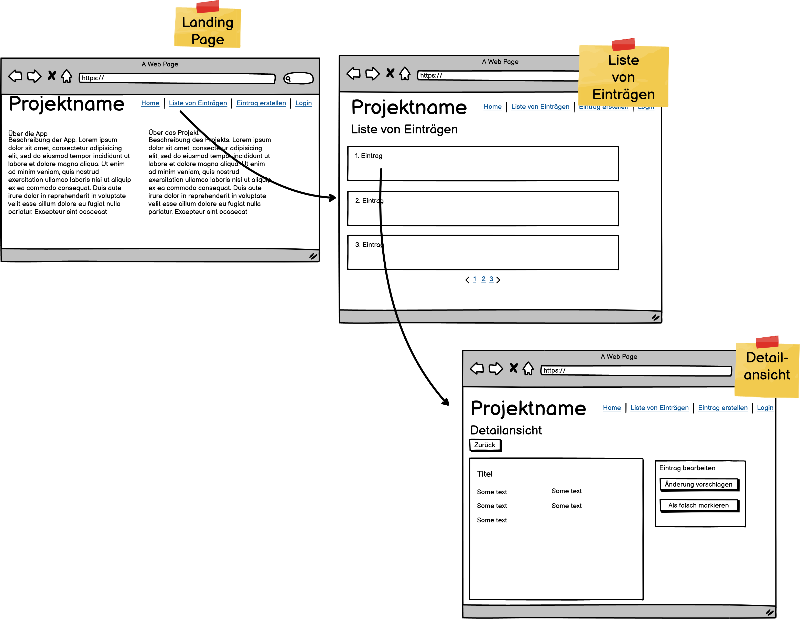
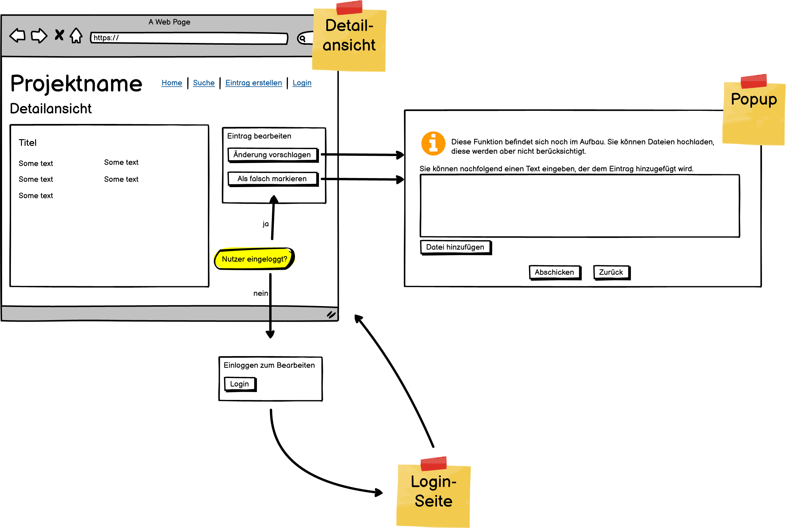
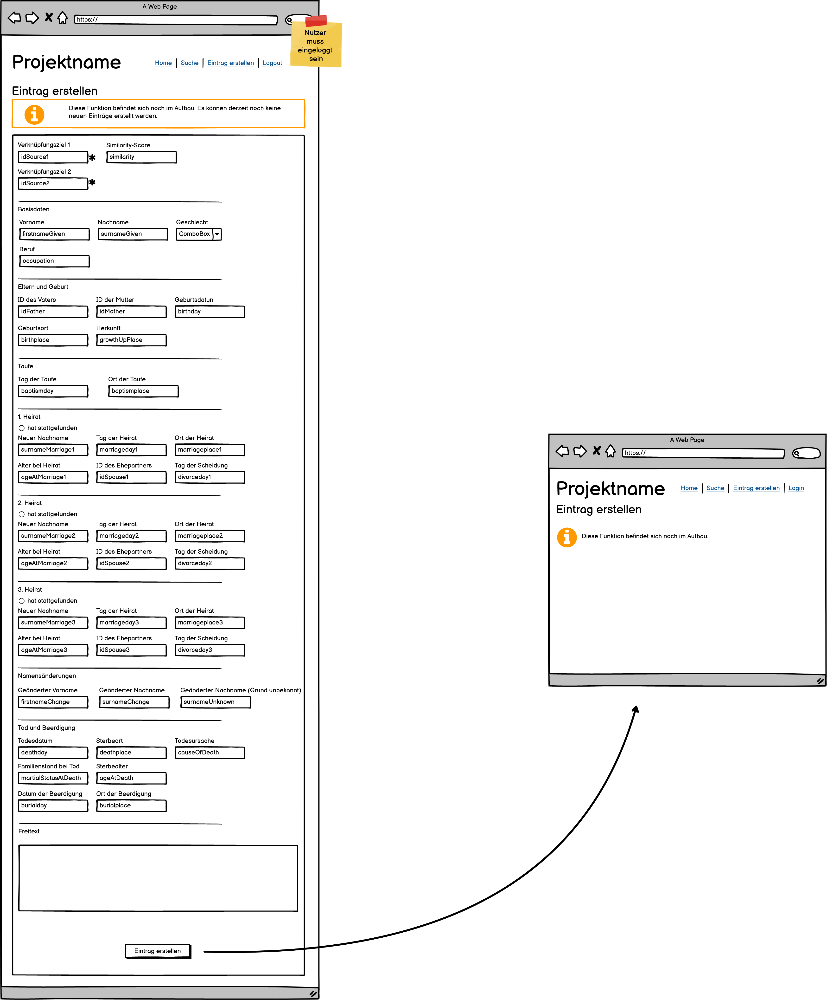
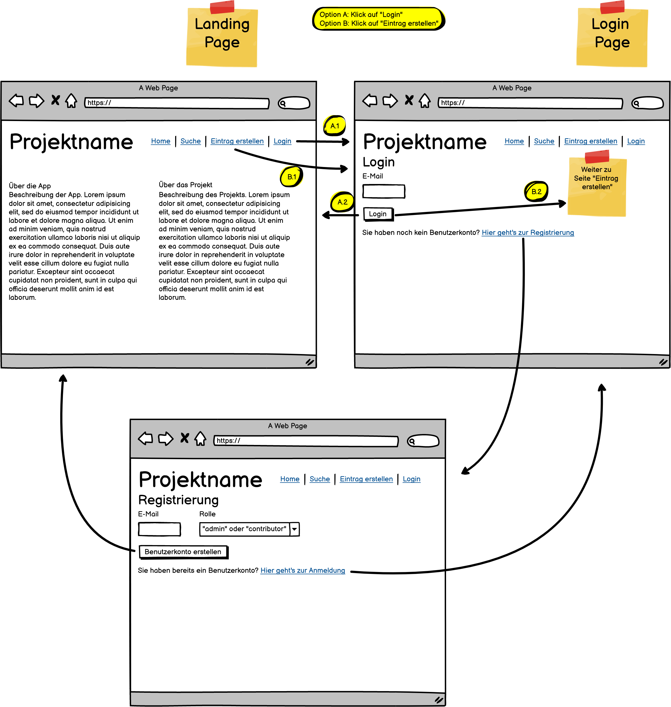

# Leipzig Time Machine - Data Entry Tool #

## Über diese Seite ##
Das Tool dient der Verwaltung eines Datensatzes von Einträgen für das Projekt der _Leipzig Time Machine_. Ein
Dateneintrag beschreibt die Verknüpfung von zwei Nennungen derselben Person in verschiedenen gesichteten Dokumenten.

Dieses Tool bietet folgende Möglichkeiten:
- Nutzerkonto erstellen, in Nutzerkonto einloggen
- Einträge ansehen, bearbeiten, erstellen

## Daten ansehen und Bearbeiten ##
__Hinweis__: Diese Funktion steht noch nicht zur Verfügung

Durch einen Klick auf __Alle Einträge__ (in der Hauptnavigationsleiste) gelangen Sie zu einer Liste aller Einträge.
Die Einträge können angeklickt werden, um zur Detailansicht zu gelangen.

In der __Detailansicht__ eines Eintrags können alle seine Werte eingesehen werden. Ist der Nutzer eingeloggt, kann der
Eintrag als falsch markiert oder eine Änderung vorgeschlagen werden. Ein Klick auf den jeweiligen Button führt Sie zu
einer Eingabemaske, um dem Eintrag eine Anmerkung hinzuzufügen.

## Einen neuen Eintrag erstellen ##
__Hinweis__: Das tatsächliche Erstellen eines Eintrags wird noch nicht unterstützt

Der Link __Neuer Eintrag__ in der Hauptnavigationsleiste führt zu einer Eingabemaske, womit ein neuer Dateneintrag
erstellt werden kann. Sind Sie nicht bereits eingeloggt, werden Sie zunächst zur Login-Seite umgeleitet. Ein
erfolgreicher Login führt Sie zurück zur Seite zum Erstellen des Eintrages.

## Login und Registrierung ##
__Hinweis__: Die Registrierung wird noch nicht unterstützt. Ein erfolgreicher Login wird Client-seitig nicht
gespeichert, geht also nach einer Aktion, die einen Seitenwechsel hervorruft, verloren. In einem echten Szenario wäre
dafür z. B. ein Token-Austausch mit dem Backend eine mögliche Implementierung.

Registrierte Benutzer können sich über den Link __Login__ der Hauptnavigation einloggen. Hat ein Benutzer noch kein
Konto erstellt, kann er dies über den Link __Account erstellen__ auf der Login-Seite tun.

## Spracheinstellung ##
Das Tool erkennt die im Browser eingestellte Sprache und schaltet sich dementsprechend um. Unterstützt wird Deutsch, in
allen anderen Fällen erscheint die Seite in Englisch.